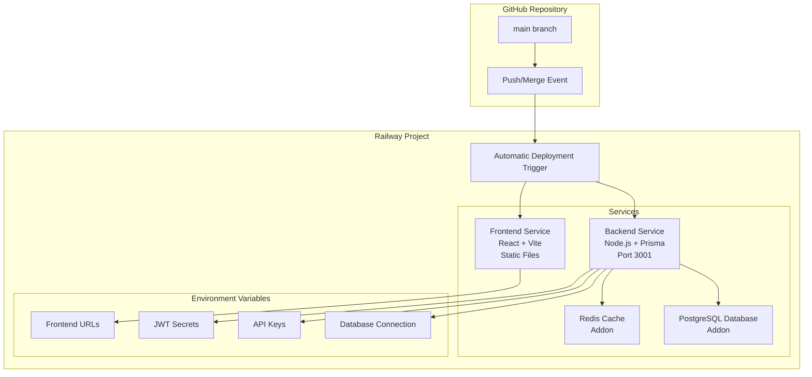
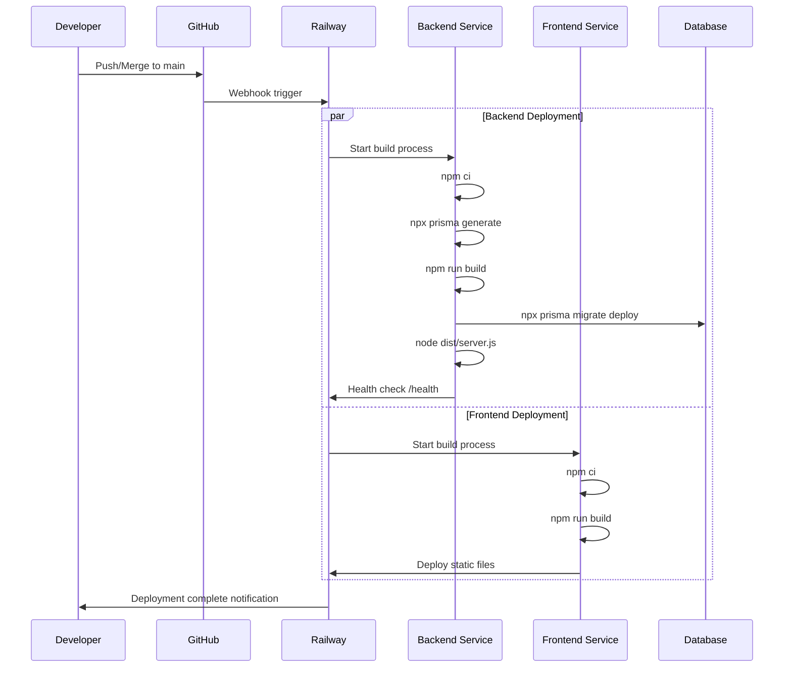

# Railway Deployment Setup Guide for HelpSavta

## Overview

This guide covers the complete Railway deployment setup process for the HelpSavta project. You have already connected your GitHub repository to Railway and created all necessary configuration files. This guide will walk you through creating services, configuring environment variables, and enabling automatic deployments.

## Current Status Assessment

### ✅ What's Already Done
- GitHub repository connected to Railway
- Railway project created
- Complete Railway configuration files:
  - `railway.toml` (root-level config)
  - `backend/railway.toml` (backend-specific config)
  - `frontend/railway.toml` (frontend-specific config)
  - `backend/nixpacks.toml` (build configuration)
  - `.railwayignore` (deployment exclusions)

### 🔲 What Still Needs to be Done
- Create backend service in Railway
- Create frontend service in Railway  
- Add PostgreSQL database addon
- Add Redis addon (optional but configured)
- Configure environment variables
- Set up service connections
- Configure deployment triggers

## Step-by-Step Setup Process

### Phase 1: Database Setup

#### 1. Add PostgreSQL Database
1. Navigate to your Railway project dashboard
2. Click **"+ New"** → **"Database"** → **"Add PostgreSQL"**
3. Railway will automatically provision the database and generate a `DATABASE_URL`
4. Note: The database URL will be available as `${{Postgres.DATABASE_URL}}`

#### 2. Add Redis Cache (Optional but Recommended)
1. Click **"+ New"** → **"Database"** → **"Add Redis"**
2. Railway will automatically provision Redis and generate a `REDIS_URL`
3. Note: The Redis URL will be available as `${{Redis.REDIS_URL}}`

### Phase 2: Backend Service Configuration

#### 1. Create Backend Service
1. Click **"+ New"** → **"GitHub Repo"**
2. Select your HelpSavta repository
3. **Important**: Set the **Root Directory** to `/backend`
4. Railway will automatically detect the `backend/railway.toml` configuration
5. The service will initially fail to deploy (this is expected)

#### 2. Configure Backend Environment Variables
Navigate to the backend service settings and add these variables:

```env
NODE_ENV=production
PORT=3001
DATABASE_URL=${{Postgres.DATABASE_URL}}
REDIS_URL=${{Redis.REDIS_URL}}
JWT_SECRET=[generate 64-character random string]
SENDGRID_API_KEY=[your SendGrid API key]
SENDGRID_FROM_EMAIL=[your verified sender email]
FRONTEND_URL=[will be set after frontend creation]
SESSION_SECRET=[generate 64-character random string]
```

**To generate secure secrets:**
```bash
# Generate JWT_SECRET (64 characters)
openssl rand -hex 32

# Generate SESSION_SECRET (64 characters)  
openssl rand -hex 32
```

### Phase 3: Frontend Service Configuration

#### 1. Create Frontend Service
1. Click **"+ New"** → **"GitHub Repo"**
2. Select your HelpSavta repository again
3. **Important**: Set the **Root Directory** to `/frontend`
4. Railway will automatically detect the `frontend/railway.toml` configuration

#### 2. Configure Frontend Environment Variables
Navigate to the frontend service settings and add these variables:

```env
NODE_ENV=production
VITE_API_URL=[backend service URL - see step 4]
VITE_APP_NAME=HelpSavta
VITE_APP_VERSION=1.0.0
```

### Phase 4: Service Interconnection

#### 1. Get Service URLs
1. Go to your backend service → **Settings** → copy the **Public Domain**
2. Go to your frontend service → **Settings** → copy the **Public Domain**

#### 2. Update Cross-Service URLs
1. **Backend Service**: Update `FRONTEND_URL` with your frontend service URL
2. **Frontend Service**: Update `VITE_API_URL` with your backend service URL

#### 3. Trigger Manual Redeploy
1. Go to each service → **Deployments** tab
2. Click **"Redeploy"** for both services
3. This ensures they pick up the new environment variables

## Deployment Architecture



## Automatic Deployment Process

### What Happens When You Merge to Main



### Backend Deployment Steps
1. **Build**: `npm ci && npx prisma generate && npm run build`
2. **Database Migration**: `npx prisma migrate deploy`
3. **Start**: `node dist/server.js`
4. **Health Check**: GET `/health` endpoint (30-second timeout)

### Frontend Deployment Steps
1. **Build**: `npm ci && npm run build`
2. **Deploy**: Static files from `dist/` folder served automatically

## Environment Variables Reference

### Backend Service Required Variables

| Variable | Source | Description |
|----------|--------|-------------|
| `DATABASE_URL` | `${{Postgres.DATABASE_URL}}` | Auto-generated PostgreSQL connection |
| `REDIS_URL` | `${{Redis.REDIS_URL}}` | Auto-generated Redis connection |
| `JWT_SECRET` | Manual | 64-character random string for JWT signing |
| `SESSION_SECRET` | Manual | 64-character random string for sessions |
| `SENDGRID_API_KEY` | Manual | Your SendGrid API key |
| `SENDGRID_FROM_EMAIL` | Manual | Verified sender email address |
| `FRONTEND_URL` | Manual | Frontend service public domain |

### Frontend Service Required Variables

| Variable | Source | Description |
|----------|--------|-------------|
| `VITE_API_URL` | Manual | Backend service public domain |
| `VITE_APP_NAME` | Manual | Application name (HelpSavta) |
| `VITE_APP_VERSION` | Manual | Current version (1.0.0) |

## First Deployment vs Automatic Deployments

### First Deployment (Manual Setup Required)
1. **Initial Service Creation**: Services will fail first deploy due to missing environment variables
2. **Configuration**: Add all required environment variables
3. **Manual Redeploy**: Trigger redeploy after configuration
4. **Database Migration**: First successful backend deploy runs initial migrations
5. **Verification**: Check health endpoints and service connectivity

### Future Deployments (Fully Automatic)
- **Trigger**: Any merge to `main` branch
- **Duration**: ~3-5 minutes total
- **Process**: Parallel build and deployment of both services
- **Zero Configuration**: No manual intervention required

## Verification Steps

### 1. Backend Health Check
```bash
curl https://[your-backend-url]/health
```
Expected response: `{"status": "ok", "timestamp": "..."}`

### 2. Frontend Access
Visit `https://[your-frontend-url]` in browser

### 3. Database Connectivity
- Check Railway logs for successful Prisma migrations
- Look for "Database migration completed" messages

### 4. API Communication
- Test frontend → backend requests through the UI
- Check Network tab in browser DevTools for successful API calls

### 5. Monitor Deployment Logs
- Backend: Look for "Server running on port 3001"
- Frontend: Look for successful static file deployment
- Database: Check for migration success messages

## Troubleshooting Common Issues

### Backend Fails to Start
- **Check**: All environment variables are set
- **Check**: Database migrations completed successfully  
- **Check**: Health endpoint responds within 30 seconds

### Frontend Shows API Errors
- **Check**: `VITE_API_URL` points to correct backend URL
- **Check**: Backend service is running and healthy
- **Check**: CORS configuration allows frontend domain

### Database Connection Issues
- **Check**: `DATABASE_URL` is correctly set to `${{Postgres.DATABASE_URL}}`
- **Check**: PostgreSQL addon is running
- **Check**: Network connectivity between services

### Environment Variable Issues
- **Remember**: Frontend variables must start with `VITE_`
- **Remember**: Backend variables are available at runtime
- **Remember**: Changes require service redeploy to take effect

## Summary

### Answer to Key Question: "Will merging to main automatically deploy?"

**YES**, but only after completing the initial setup:

1. ✅ **Services Created**: Backend and frontend services configured
2. ✅ **Database Added**: PostgreSQL (and optionally Redis) provisioned  
3. ✅ **Environment Variables Set**: All required variables configured
4. ✅ **Service URLs Connected**: Frontend and backend can communicate

Once this setup is complete, every merge to `main` will automatically trigger deployment of both services with zero manual intervention required.

### Next Steps
1. Follow Phase 1-4 setup steps above
2. Verify all services are running correctly
3. Make a test commit to `main` branch
4. Confirm automatic deployment works as expected

Your Railway configuration files are already optimized for this workflow - you just need to complete the service setup in the Railway dashboard.