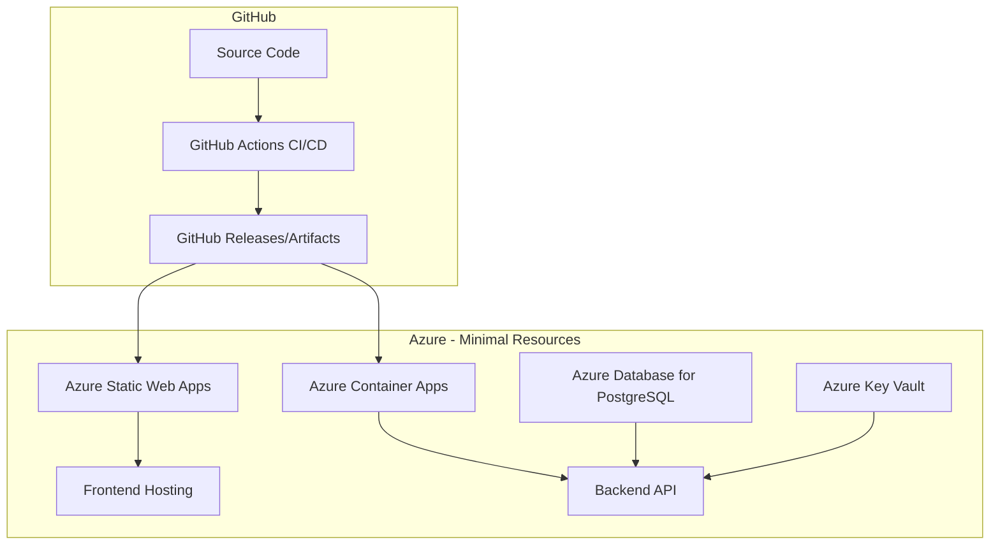

# עזרה טכנית בהתנדבות - Help-Savta (HelpSavta)

## Project Overview / סקירת הפרויקט

**עברית:**
מערכת מקוונת מקיפה לניהול שירות התנדבותי לעזרה טכנית לאוכלוסיית הגיל השלישי. המערכת מאפשרת לאזרחים ותיקים לבקש עזרה טכנית באמצעות טופס נגיש וידידותי, ולמתנדבים לנהל בקשות ולתזמן ביקורי עזרה בצורה יעילה ומקצועית.

**English:**
A comprehensive online system for managing volunteer technical help services for elderly citizens. The system enables senior citizens to request technical assistance through an accessible, user-friendly form, while allowing volunteers to efficiently manage requests and schedule help visits in a professional manner.

## 🌟 Key Features / תכונות מרכזיות

### 👥 Public User Features / תכונות למשתמש הציבור
- **🏠 Home Page** - Welcome interface with clear service overview (עמוד בית עם הסבר ברור על השירות)
- **📝 Help Request Form** - Simple, accessible form with Hebrew RTL support (טופס בקשת עזרה פשוט ונגיש)
  - Personal information collection (שם, טלפון, כתובת)
  - Detailed problem description (תיאור מפורט של הבעיה)
  - Urgency level selection (בחירת רמת דחיפות: נמוכה/בינונית/גבוהה/דחוף)
  - Additional notes field (שדה הערות נוסף)
- **⏰ Time Slot Selection** - Interactive calendar with available appointment times (בחירת זמן עם לוח זמנים אינטראקטיבי)
- **✅ Confirmation Process** - Request summary and submission confirmation (סיכום הבקשה ואישור שליחה)

### 🔧 Admin Features / תכונות מנהל
- **📊 Comprehensive Dashboard** - Statistics overview and recent activity (לוח בקרה עם סטטיסטיקות וסקירת פעילות)
- **📋 Request Management** - View, edit, filter, and search all requests (ניהול בקשות - צפייה, עריכה, סינון וחיפוש)
  - Status updates and assignment tracking (עדכון סטטוס ומעקב הקצאות)
  - Urgency-based filtering and color coding (סינון לפי דחיפות וקידוד צבעים)
  - Admin assignment and notes system (הקצאת מנהלים ומערכת הערות)
- **🕐 Time Slot Management** - Create and manage available appointment slots (ניהול שעות זמינות)
  - Individual and bulk slot creation (יצירת שעות בודדות ובכמות)
  - Calendar view and conflict detection (תצוגת לוח שנה וזיהוי התנגשויות)
- **👨‍💼 Admin User Management** - Secure authentication and multi-admin support (ניהול משתמשי מנהל ואימות מאובטח)
- **📧 Email Notifications** - Automated approval emails when requests are scheduled (התראות אימייל אוטומטיות)

## 🏗️ Technology Stack / מחסנית טכנולוגית

### Backend
- **Node.js + Express.js** - Modern server framework
- **TypeScript** - Type-safe development
- **Prisma ORM** - Database management with SQLite/PostgreSQL support
- **bcryptjs** - Secure password hashing
- **express-session** - Session management
- **Joi** - Comprehensive data validation
- **NodeMailer** - Email notifications
- **Helmet** - Security middleware

### Frontend
- **React 18 + TypeScript** - Modern UI development
- **Vite** - Fast build tool and development server
- **Tailwind CSS** - Utility-first CSS framework
- **React Hook Form** - Efficient form handling
- **Axios** - HTTP client for API communication
- **React Router** - Client-side routing
- **Lucide React** - Modern icon library

## 🚀 Quick Start / התחלה מהירה

### Prerequisites / דרישות מקדימות
- Node.js 18+
- npm or yarn

### Installation / התקנה

1. **Clone the repository / שכפל את הריפוזיטורי:**
```bash
git clone <repository-url>
cd HelpSavta
```

2. **One-command setup / הגדרה בפקודה אחת:**
```bash
./start.sh
```

**OR manual setup / או הגדרה ידנית:**

```bash
# Install dependencies / התקן תלויות
npm install
cd backend && npm install
cd ../frontend && npm install && cd ..

# Setup database / הגדר מסד נתונים
cd backend
npm run db:generate
npm run db:push
npm run db:seed
cd ..

# Start development servers / הפעל שרתי פיתוח
npm run dev
```

This will start:
- **Backend API:** http://localhost:3001
- **Frontend App:** http://localhost:5173
- **Admin Panel:** http://localhost:5173/admin/login

### Default Admin Credentials / פרטי מנהל ברירת מחדל
- **Username / שם משתמש:** `[Configure in backend/.env]`
- **Password / סיסמה:** `[Configure in backend/.env]`

⚠️ **Important: Change these credentials before production deployment!**

## 📁 Project Structure / מבנה הפרויקט

```
HelpSavta/
├── backend/                     # Backend server
│   ├── src/
│   │   ├── middleware/          # Express middleware (auth, validation, error handling)
│   │   ├── routes/             # API routes (admin, auth, requests, slots)
│   │   ├── services/           # Business logic (email service)
│   │   └── server.ts           # Main server file
│   ├── prisma/
│   │   ├── schema.prisma       # Database schema
│   │   └── seed.ts            # Database seeding
│   └── package.json
├── frontend/                    # Frontend React app
│   ├── src/
│   │   ├── components/         # Reusable UI components
│   │   ├── pages/             # Page components (Home, RequestHelp, Admin)
│   │   ├── services/          # API services
│   │   └── types/             # TypeScript type definitions
│   └── package.json
├── README.md                    # This file
├── project_status.md           # Current development status for coding agents
├── start.sh                    # Development setup script
├── docker-compose.yml          # Docker development environment
├── docker-compose.production.yml # Docker production environment
└── package.json               # Root package.json
```

## 🔗 API Endpoints / נקודות קצה API

### Public Endpoints
- `GET /health` - Health check
- `GET /api/slots/available` - Get available time slots
- `POST /api/requests` - Create help request

### Admin Endpoints (Protected)
- `POST /api/auth/login` - Admin login
- `GET /api/admin/dashboard` - Dashboard statistics
- `GET /api/admin/requests` - Get all requests with filtering
- `PUT /api/admin/requests/:id` - Update request fields
- `POST /api/admin/requests/:id/take` - Assign request to admin
- `GET /api/admin/slots` - Manage time slots
- `POST /api/admin/slots/bulk` - Create multiple time slots

## 🔐 Security Features / תכונות אבטחה

- **Password Security** - bcrypt hashing with salt
- **Session Management** - Secure session-based authentication
- **Input Validation** - Comprehensive Joi validation schemas
- **CORS Protection** - Cross-origin request security
- **Rate Limiting** - API abuse prevention
- **XSS Protection** - Helmet security headers
- **SQL Injection Prevention** - Prisma ORM parameterized queries

## ♿ Accessibility Features / תכונות נגישות

- **RTL Support** - Complete Hebrew right-to-left layout
- **Elderly-Friendly Design** - Large fonts and high contrast colors
- **Keyboard Navigation** - Full keyboard accessibility
- **Screen Reader Support** - Semantic HTML and ARIA labels
- **Mobile-First Design** - Responsive design for all devices
- **Large Click Targets** - Easy interaction for elderly users

## 🌐 Browser Support / תמיכה בדפדפנים

- ✅ Chrome 90+
- ✅ Firefox 88+
- ✅ Safari 14+
- ✅ Edge 90+
- ✅ Mobile browsers (iOS Safari, Chrome Mobile)

## 🔧 Development Scripts / סקריפטי פיתוח

### Root Level
```bash
npm run dev          # Start both backend and frontend
npm run build        # Build both projects
npm run health       # Check application health
./start.sh           # One-command development setup
./test-integration.sh # Run integration tests
```

### Backend
```bash
npm run dev          # Start development server
npm run build        # Build TypeScript
npm run start        # Start production server
npm run db:generate  # Generate Prisma client
npm run db:push      # Push schema to database
npm run db:seed      # Seed database with initial data
```

### Frontend
```bash
npm run dev          # Start development server
npm run build        # Build for production
npm run preview      # Preview production build
```

## 🌍 Basic Deployment / פריסה בסיסית

### Environment Variables / משתני סביבה
Create `backend/.env`:
```env
DATABASE_URL="file:./dev.db"
NODE_ENV=development
PORT=3001
SESSION_SECRET=your-very-long-random-secret-key
FRONTEND_URL=http://localhost:5173
DEFAULT_ADMIN_USERNAME=admin
DEFAULT_ADMIN_PASSWORD=change-this-password

# SendGrid Email Configuration (Recommended)
SENDGRID_API_KEY=SG.your-sendgrid-api-key-here
EMAIL_FROM=noreply@helpsavta.com
EMAIL_FROM_NAME=Help Savta
EMAIL_REPLY_TO=support@helpsavta.com
SUPPORT_EMAIL=support@helpsavta.com

# SMTP Fallback Configuration (Optional)
EMAIL_HOST=smtp.gmail.com
EMAIL_PORT=587
EMAIL_USER=your-email@gmail.com
EMAIL_PASS=your-app-password
```

## 🚀 Simplified CI/CD Pipeline / צינור אינטגרציה ופריסה מופשט

HelpSavta has been redesigned with a **simplified CI/CD pipeline** using modern Azure serverless services for 90% cost reduction while maintaining all functionality.

### 🏗️ Simplified Architecture Overview

**New Architecture: Azure Static Web Apps + Azure Container Apps**



### 📋 Simplified Pipeline Overview

#### 1. **PR Validation** - Pull Request Triggers
The PR validation pipeline ([`pr-validation.yml`](.github/workflows/pr-validation.yml)) runs on pull requests:

- ✅ **Build and Test Only** - No deployment on PRs
- ✅ **Frontend Tests** - Lint, test, and build verification
- ✅ **Backend Tests** - Unit tests and build verification
- ✅ **Validation Gate** - Tests MUST pass before PR can be merged

#### 2. **Production Deployment** - Main Branch Only
The deployment pipeline ([`deploy-simplified.yml`](.github/workflows/deploy-simplified.yml)) triggers on main branch merges:

- 🔨 **Build and Test** - Full validation before deployment
- 📦 **Create Artifacts** - Store build artifacts in GitHub
- 🌐 **Deploy Frontend** - Direct deployment to Azure Static Web Apps
- 🐳 **Deploy Backend** - Container deployment to Azure Container Apps
- 🗄️ **Database Migrations** - Automatic Prisma migrations
- 🔍 **Health Checks** - Comprehensive deployment verification

### 🎯 Simplified Azure Infrastructure

**Cost Comparison:**
- **Before**: ~$242/month (App Service Plan P1v3, Redis, Container Registry, etc.)
- **After**: ~$26/month (Static Web Apps Free + Container Apps + PostgreSQL Burstable)
- **Savings**: 90% cost reduction (~$216/month)

**New Infrastructure (Bicep template: [`azure/simplified-main.bicep`](azure/simplified-main.bicep)):**
- ✅ **Azure Static Web Apps** - Frontend hosting (Free tier)
- ✅ **Azure Container Apps** - Backend API (serverless, scale-to-zero)
- ✅ **PostgreSQL Flexible Server** - Database (Burstable tier)
- ✅ **Azure Key Vault** - Secrets management (kept from old setup)
- ❌ **Removed**: App Service, Container Registry, Redis, Application Insights, CDN, Storage Account

### 🧹 Migration and Cleanup

**Azure Resource Cleanup:**
```bash
# Clean up old expensive Azure resources
./scripts/cleanup-azure-resources.sh

# Deploy new simplified infrastructure
az deployment group create \
  --resource-group helpsavta-prod-rg \
  --template-file azure/simplified-main.bicep \
  --parameters @azure/simplified-parameters.json
```

**Files Removed:**
- Old CI/CD workflows (`ci.yml`, `deploy.yml`)
- Complex Azure infrastructure (`main.bicep`, multiple parameter files)
- Docker compose files (no longer needed)
- Complex deployment scripts
- Frontend Docker files (Static Web Apps handles this)

### 🔐 Required GitHub Secrets Configuration

**Complete GitHub Secrets Setup Guide:** See [`DEPLOYMENT_SECRETS.md`](DEPLOYMENT_SECRETS.md) for comprehensive configuration instructions.

**Required Repository Secrets:**
```bash
# Azure Authentication
AZURE_CREDENTIALS - Service principal JSON (clientId, clientSecret, subscriptionId, tenantId)
AZURE_SUBSCRIPTION_ID - Azure subscription: 6720ecf6-4ad2-4909-b6b6-4696eb862b26
AZURE_RESOURCE_GROUP - Resource group: helpsavta-prod-rg

# Azure Container Registry
AZURE_CONTAINER_REGISTRY - ACR login server (e.g., helpsavtaprodacr.azurecr.io)
AZURE_CONTAINER_REGISTRY_USERNAME - ACR username
AZURE_CONTAINER_REGISTRY_PASSWORD - ACR access key

# Azure Static Web Apps
AZURE_STATIC_WEB_APPS_API_TOKEN - Deployment token (regenerate if expired)

# Database and Application
DATABASE_URL_PRODUCTION - PostgreSQL connection string
SENDGRID_API_KEY - Email service API key
SESSION_SECRET - Strong session secret (32+ characters)
ADMIN_USERNAME - Default admin username
ADMIN_PASSWORD - Strong admin password
EMAIL_FROM - From email address (e.g., noreply@helpsavta.com)
```

**⚠️ Common Issue**: Static Web Apps token expiration causes `deployment_token provided was invalid` error.
**Solution**: Regenerate token in Azure Portal → Static Web Apps → Manage deployment token.

See [`DEPLOYMENT_SECRETS.md`](DEPLOYMENT_SECRETS.md) for:
- Step-by-step Azure Portal instructions
- Token regeneration procedures
- Verification commands for each secret
- Troubleshooting guide for common issues

### 📊 Simple Analytics

**Built-in User Metrics Collection:**
- IP address and location tracking
- User agent and device information
- Endpoint usage analytics
- Timestamp and session tracking

Implementation: [`backend/src/middleware/analytics.ts`](backend/src/middleware/analytics.ts)

### 🚀 Deployment Process

1. **Create PR** → Triggers validation (build + test only)
2. **Merge to Main** → Triggers full deployment:
   - Build and test both frontend and backend
   - Create deployment artifacts
   - Deploy frontend to Static Web Apps
   - Deploy backend to Container Apps
   - Run database migrations
   - Verify deployment health

### 🎯 Benefits of Simplified Architecture

- ✅ **90% Cost Reduction** - From ~$242 to ~$26/month
- ✅ **Zero Server Management** - Fully serverless architecture
- ✅ **Auto-scaling** - Scale to zero when not in use
- ✅ **Global CDN** - Built into Static Web Apps
- ✅ **Automatic HTTPS** - SSL certificates handled automatically
- ✅ **Simplified Operations** - Minimal maintenance required

## 🧪 Testing / בדיקות

### SendGrid Email Testing
```bash
# Test SendGrid configuration and email delivery
cd backend
npm run test:sendgrid-standalone your-email@example.com

# Test specific email types
npm run test:sendgrid-standalone your-email@example.com simple
npm run test:sendgrid-standalone your-email@example.com template
npm run test:sendgrid-standalone your-email@example.com both
```

**Note:** Before testing emails, you need to:
1. Set up SendGrid account and get API key
2. Update `SENDGRID_API_KEY` in `backend/.env`
3. See [`SENDGRID_SETUP_INSTRUCTIONS.md`](SENDGRID_SETUP_INSTRUCTIONS.md) for complete setup guide

### Integration Testing
```bash
# Run full integration test suite
./test-integration.sh

# Test admin-specific features
./test-admin-features.sh

# Manual health check
curl http://localhost:3001/health
```

### Manual Testing Checklist
- [ ] Home page loads with Hebrew content
- [ ] Help request form submission works
- [ ] Time slot selection functions
- [ ] Admin login and authentication
- [ ] Dashboard displays statistics
- [ ] Request management (view, edit, filter)
- [ ] Time slot management
- [ ] Email notifications (if configured)
- [ ] Mobile responsiveness
- [ ] Browser compatibility

## 📊 Current Status / סטטוס נוכחי

**🚀 Production Ready: ✅ All Critical Deployment Blockers Resolved**

The HelpSavta application is fully functional and ready for immediate production deployment. **Latest Critical Updates (2025-05-31T09:55):**

### 🚨 **Critical Deployment Blockers Fixed**
- ✅ **Resource Group Name Mismatch** - All workflows now correctly target `helpsavta-prod-rg` instead of `helpsavta-production`
- ✅ **Container Registry Strategy** - Validated consistent GitHub Container Registry usage across all components
- ✅ **Key Vault Integration** - Fixed Container Apps Key Vault format from incorrect `@Microsoft.KeyVault(...)` to proper `secretRef` with `keyVaultUrl`
- ✅ **Database Migration Strategy** - Consolidated to single migration point in Docker entrypoint, eliminating conflicts
- ✅ **Cross-Region Database Connectivity** - Enhanced connection string for optimal West Europe ↔ North Europe connectivity

### 🎯 **Infrastructure Ready Status**
| Component | Status | Deployment Ready |
|-----------|--------|------------------|
| **Resource Group Targeting** | ✅ **FIXED** | All workflows target correct production resource group |
| **Container Registry** | ✅ **VALIDATED** | Consistent GitHub Container Registry strategy |
| **Key Vault Integration** | ✅ **FIXED** | Container Apps can now access secrets properly |
| **Migration Strategy** | ✅ **CONSOLIDATED** | No conflicts, single reliable migration approach |
| **Database Connectivity** | ✅ **ENHANCED** | Optimized for cross-region reliability |

### 🚀 **Previous Major Achievements**
- ✅ **Complete CI/CD Pipeline Suite** - 4 specialized workflows for backend, frontend, infrastructure, and environment management
- ✅ **Simplified Azure Architecture** - 90% cost reduction from ~$242 to ~$26/month using serverless Container Apps
- ✅ **Production-Safe Database Migrations** - Docker entrypoint uses `prisma migrate deploy` for production safety
- ✅ **Dynamic Health Checks** - Real-time URL discovery and comprehensive endpoint verification
- ✅ **Comprehensive Error Handling** - Retry logic, timeouts, and clear error reporting throughout pipeline
- ✅ **GitHub Secrets Documentation** - Complete configuration guide in [`DEPLOYMENT_SECRETS.md`](DEPLOYMENT_SECRETS.md)

### **🎯 Deployment Command Ready**
```bash
# All critical blockers resolved - safe to deploy immediately
git push origin main

# Or manual trigger: GitHub Actions → Deploy Infrastructure → Run workflow
```

**🚀 Deployment Status**: **ALL CRITICAL DEPLOYMENT BLOCKERS ELIMINATED** - The infrastructure is production-ready with all validation report issues resolved.

All core features implemented, tested, and deployment pipeline operational. For comprehensive status details, see [`project_status.md`](project_status.md).

## 🤝 Contributing / תרומה

1. Fork the repository
2. Create a feature branch (`git checkout -b feature/amazing-feature`)
3. Make your changes
4. Test thoroughly (run integration tests)
5. Commit your changes (`git commit -m 'Add amazing feature'`)
6. Push to the branch (`git push origin feature/amazing-feature`)
7. Open a Pull Request

## 📞 Support / תמיכה

For support, questions, or feature requests:
- **Issues**: Create an issue in the repository
- **Current Status**: Check [`project_status.md`](project_status.md) for system metrics and known issues
- **Email Setup**: See [`SENDGRID_SETUP_INSTRUCTIONS.md`](SENDGRID_SETUP_INSTRUCTIONS.md) for complete SendGrid configuration guide
- **Email System**: SendGrid integration with Hebrew RTL templates (✅ RTL alignment fixed), SMTP fallback, and Azure KeyVault production configuration

## 📄 License / רישיון

MIT License - see LICENSE file for details

---

**Made with ❤️ for the volunteer community / נוצר באהבה עבור קהילת המתנדבים**

*הפרויקט מיועד לסייע לאוכלוסיית הגיל השלישי לקבל עזרה טכנית באמצעות מתנדבים מסורים*

<!-- CI/CD Pipeline Test - 2025-05-30 18:23 --># GitHub Secrets Configuration Fixed - Fri May 30 23:37:49 IDT 2025
