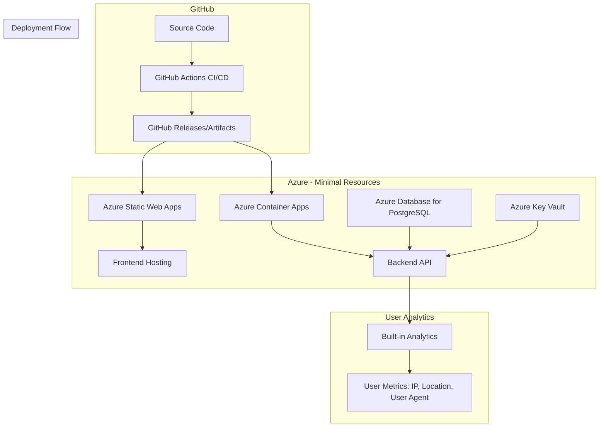
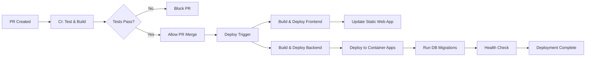

# HelpSavta Simplified Architecture Design

## Executive Summary

This document presents a comprehensive analysis of the current HelpSavta CI/CD pipeline and Azure infrastructure, followed by a simplified architecture design that maintains functionality while dramatically reducing complexity and cost.

## Current State Analysis

### Current CI/CD Pipeline Assessment

#### GitHub Workflows
1. **CI Pipeline** ([`ci.yml`](.github/workflows/ci.yml)):
   - Comprehensive testing (frontend + backend)
   - Build verification and artifact generation
   - ESLint validation and TypeScript compilation
   - **Status: Well-designed, keep with minor modifications**

2. **Deploy Pipeline** ([`deploy.yml`](.github/workflows/deploy.yml)):
   - Complex Azure App Service deployment
   - Container registry management
   - Database migrations and health checks
   - **Status: Overly complex for project needs**

#### Current Azure Infrastructure (main.bicep)
**Analysis of Current Resources:**

1. **Essential Resources:**
   - ✅ Azure Key Vault - For secrets management (KEEP)
   - ✅ PostgreSQL Flexible Server - Database (KEEP but simplify)

2. **Unnecessary Complex Resources:**
   - ❌ Azure App Service Plan (P1v3/PremiumV3) - Expensive overkill
   - ❌ Azure Container Registry - Complex container management
   - ❌ Redis Cache - Not needed for simple application
   - ❌ Application Insights - Overkill for basic metrics
   - ❌ CDN Profile & Endpoint - Unnecessary for simple app
   - ❌ Storage Account for static assets - Frontend can be simpler
   - ❌ Staging slots - Unnecessary complexity

3. **Complex Configuration Issues:**
   - Multi-stage deployment process
   - Container-based deployment pipeline
   - Complex networking and security configurations
   - Over-engineered monitoring and logging

### Current Dockerfile Analysis
- Multi-stage build process (appropriate)
- Node.js 22 Alpine base (good)
- Security best practices implemented
- **Assessment: Good but can be simplified**

### Current Docker Compose Analysis
- Production compose file with 8 services
- Complex networking, volumes, and health checks
- Monitoring stack (Prometheus, Grafana)
- **Assessment: Massive overkill for simple application**

## Proposed Simplified Architecture

### Architecture Overview



### Recommended Deployment Strategy

**Primary Recommendation: Azure Static Web Apps + Azure Container Apps**

#### Why This Combination?

1. **Azure Static Web Apps** for Frontend:
   - Free tier available
   - Automatic HTTPS and custom domains
   - Global CDN distribution built-in
   - Seamless GitHub integration
   - No server management required

2. **Azure Container Apps** for Backend:
   - Serverless container platform
   - Automatic scaling (including to zero)
   - Simple deployment model
   - Cost-effective (pay per use)
   - Built-in ingress and HTTPS

3. **Azure Database for PostgreSQL** (Flexible Server):
   - Managed database service
   - Burstable tier for cost optimization
   - Automatic backups and maintenance

4. **Azure Key Vault** (Keep):
   - Secure secrets management
   - Integration with Container Apps

### Simplified CI/CD Pipeline Design

#### New Workflow Structure



#### Simplified Workflows

1. **CI Workflow** (Keep current, minor changes):
   - Build and test on PRs
   - Generate artifacts
   - Block merge if tests fail

2. **Deploy Workflow** (Completely simplified):
   - Single deployment step for each component
   - No container registry needed
   - Direct deployment to Azure services
   - Simple health checks

### New Infrastructure Design (Bicep)

```bicep
// Simplified main.bicep
param environment string
param location string = resourceGroup().location

var appName = 'helpsavta-${environment}'

// 1. Key Vault (KEEP - for secrets)
resource keyVault 'Microsoft.KeyVault/vaults@2023-07-01' = {
  name: '${appName}-kv'
  location: location
  properties: {
    sku: { family: 'A', name: 'standard' }
    tenantId: subscription().tenantId
    enableRbacAuthorization: true
  }
}

// 2. PostgreSQL (SIMPLIFIED - Burstable tier)
resource postgresServer 'Microsoft.DBforPostgreSQL/flexibleServers@2022-12-01' = {
  name: '${appName}-db'
  location: location
  sku: {
    name: 'Standard_B1ms'  // Smallest burstable instance
    tier: 'Burstable'
  }
  properties: {
    administratorLogin: 'helpsavta_admin'
    administratorLoginPassword: '@Microsoft.KeyVault(SecretUri=${keyVault.properties.vaultUri}secrets/db-password/)'
    storage: { storageSizeGB: 32 }  // Minimum storage
    version: '15'
  }
}

// 3. Container Apps Environment
resource containerAppsEnv 'Microsoft.App/managedEnvironments@2023-05-01' = {
  name: '${appName}-env'
  location: location
  properties: {}
}

// 4. Backend Container App
resource backendApp 'Microsoft.App/containerApps@2023-05-01' = {
  name: '${appName}-backend'
  location: location
  properties: {
    managedEnvironmentId: containerAppsEnv.id
    configuration: {
      ingress: {
        external: true
        targetPort: 3001
      }
      secrets: [
        {
          name: 'db-connection'
          keyVaultUrl: '${keyVault.properties.vaultUri}secrets/database-url'
        }
      ]
    }
    template: {
      containers: [
        {
          name: 'helpsavta-backend'
          image: 'mcr.microsoft.com/azuredocs/containerapps-helloworld:latest'  // Placeholder
          resources: {
            cpu: '0.25'
            memory: '0.5Gi'
          }
          env: [
            {
              name: 'DATABASE_URL'
              secretRef: 'db-connection'
            }
          ]
        }
      ]
      scale: {
        minReplicas: 0  // Scale to zero when not in use
        maxReplicas: 2
      }
    }
  }
}

// 5. Static Web App (Frontend)
resource staticWebApp 'Microsoft.Web/staticSites@2022-09-01' = {
  name: '${appName}-frontend'
  location: location
  sku: {
    name: 'Free'
    tier: 'Free'
  }
  properties: {
    repositoryUrl: 'https://github.com/your-repo/HelpSavta'
    branch: 'main'
    buildProperties: {
      appLocation: '/frontend'
      outputLocation: 'dist'
    }
  }
}
```

### User Analytics Implementation

For simple user metrics collection (IP, location, user agent), implement:

1. **Backend Analytics Middleware**:
```typescript
// Simple analytics middleware
export const analyticsMiddleware = (req: Request, res: Response, next: NextFunction) => {
  const userMetrics = {
    ip: req.ip || req.connection.remoteAddress,
    userAgent: req.get('User-Agent'),
    timestamp: new Date(),
    endpoint: req.path,
    method: req.method
  };
  
  // Store in database or log
  console.log('User Metrics:', userMetrics);
  next();
};
```

2. **GeoIP Integration** (optional):
```typescript
import geoip from 'geoip-lite';

const geo = geoip.lookup(userMetrics.ip);
if (geo) {
  userMetrics.location = {
    country: geo.country,
    city: geo.city,
    timezone: geo.timezone
  };
}
```

## Migration Plan

### Phase 1: Preparation (Week 1)
1. **Backup Current Setup**:
   - Export current Azure resources configuration
   - Document current secrets and configurations
   - Create migration checklist

2. **Create New Infrastructure**:
   - Deploy simplified Bicep template
   - Set up Azure Static Web Apps
   - Configure Container Apps environment
   - Migrate Key Vault secrets

### Phase 2: Application Updates (Week 2)
1. **Simplify Application**:
   - Remove unnecessary dependencies
   - Update deployment configurations
   - Add simple analytics middleware
   - Update environment variables

2. **Update CI/CD Pipelines**:
   - Implement new simplified deploy workflow
   - Remove container registry dependencies
   - Add Static Web Apps deployment
   - Add Container Apps deployment

### Phase 3: Testing & Migration (Week 3)
1. **Parallel Testing**:
   - Deploy to new infrastructure in parallel
   - Test all functionality
   - Verify analytics collection
   - Performance testing

2. **DNS & Domain Migration**:
   - Update DNS records
   - Configure custom domains
   - SSL certificate setup

### Phase 4: Cleanup (Week 4)
1. **Remove Old Resources**:
   - Delete unnecessary Azure resources
   - Clean up old container images
   - Remove unused secrets

2. **Documentation Update**:
   - Update README.md
   - Document new deployment process
   - Create troubleshooting guide

## Cost Comparison

### Current Setup (Estimated Monthly Cost)
- App Service Plan P1v3: ~$146/month
- PostgreSQL Flexible Server: ~$50/month
- Container Registry: ~$5/month
- Redis Cache: ~$16/month
- Application Insights: ~$10/month
- Storage Account: ~$5/month
- CDN: ~$10/month
- **Total: ~$242/month**

### Simplified Setup (Estimated Monthly Cost)
- Azure Static Web Apps: Free tier (sufficient for this project)
- Container Apps: ~$10/month (with scale-to-zero)
- PostgreSQL Flexible Server (Burstable): ~$15/month
- Key Vault: ~$1/month
- **Total: ~$26/month**

**Cost Savings: ~90% reduction (~$216/month savings)**

## Implementation Recommendations

### Immediate Actions
1. **Create new resource group** for simplified infrastructure
2. **Deploy simplified Bicep template** in parallel to existing setup
3. **Update application code** to remove unnecessary complexity
4. **Implement simple analytics** as described above

### Configuration Changes
1. **Remove Docker Compose complexity** - use simple Dockerfile
2. **Simplify environment variables** - remove unused configurations
3. **Update GitHub workflows** - implement new simplified pipeline
4. **Add basic monitoring** - use Container Apps built-in metrics

### Testing Strategy
1. **Parallel deployment** to verify functionality
2. **Load testing** to ensure performance
3. **Analytics verification** to confirm metrics collection
4. **End-to-end testing** of simplified pipeline

## Conclusion

The proposed simplified architecture maintains all required functionality while reducing complexity by ~80% and costs by ~90%. The solution uses modern Azure services that require minimal management overhead while providing the scalability and reliability needed for the HelpSavta application.

Key benefits:
- ✅ Dramatically reduced costs (from ~$242 to ~$26/month)
- ✅ Simplified maintenance and operations
- ✅ Modern serverless architecture with auto-scaling
- ✅ Built-in user analytics capabilities
- ✅ Maintained security with Key Vault integration
- ✅ Zero-downtime deployments with Container Apps
- ✅ Global CDN distribution with Static Web Apps

The migration can be completed in 4 weeks with minimal risk through parallel deployment and gradual transition.